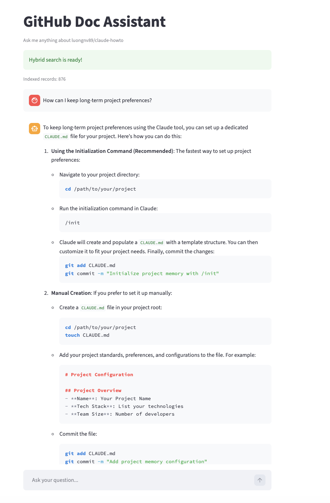

# GitHub Doc Assistant

A small AI project that answers questions about a GitHub repository by retrieving relevant documentation first, then generating an answer based on that content.

This version is built around the repository [`luongnv89/claude-howto`](https://github.com/luongnv89/claude-howto).



---

## What this project does

Given a GitHub repository, the system:

- downloads and parses markdown documentation
- splits long files into smaller chunks
- builds a search system over the documentation
- lets an AI agent use that search system as a tool before answering questions

The goal is to make the answers more grounded in the actual repository, instead of relying only on general LLM knowledge.

---

## Why I built this

I wanted to build a small end-to-end RAG project and understand the whole pipeline in practice:

- data ingestion
- chunking
- retrieval
- agent tool use
- evaluation
- simple deployment

I also wanted something that is easy to demo and easy to explain in an interview.

---

## Repository used

This project currently uses:

- **Repo**: `luongnv89/claude-howto`

It works especially well for documentation-heavy repositories with many `.md` or `.mdx` files.

---

## How it works

At a high level, the system has four steps:

### 1. Ingestion
It downloads the repository as a zip archive from GitHub and extracts markdown files.

### 2. Chunking
Long documents are split into overlapping chunks so they are easier to search and pass to the model.

### 3. Retrieval
The system supports:

- **text search** for exact keyword matching
- **vector search** for semantic similarity
- **hybrid search** that combines both

### 4. Agent
A Pydantic AI agent uses the search function as a tool.  
Before answering, it retrieves relevant content and uses that material to generate a grounded response.

---

## Example questions

A few example questions that work well:

- How do I use memory in this repository?
- What does this repository say about plugins?
- How can I keep long-term project preferences?
- How do I get started with Claude Code according to this repo?

---

## Example behavior

One useful case is when the user asks something that does **not** exactly match the wording in the documentation.

For example:

> How can I keep long-term project preferences?

This is not necessarily phrased the same way as the source text, but hybrid search can still retrieve the relevant documentation around memory and `CLAUDE.md`.

That is one reason I added vector search on top of basic text search.

---

## Running locally

### Requirements

- Python 3.12+
- `uv` for dependency management
- OpenAI API key

### Install dependencies

```bash
uv sync
```

### Set API key

Create a `.env` file in the project root:

```bash
OPENAI_API_KEY=your_key_here
```

### Run the CLI version

```bash
uv run python agent_app.py
```

### Run the Streamlit UI

```bash
uv run streamlit run app.py
```

Then open the local Streamlit link shown in the terminal, usually:

```text
http://localhost:8501
```

---

## Project structure

```text
project/
├── ingest.py          # downloads repo data, parses markdown, chunks documents
├── search_tools.py    # text / vector / hybrid search logic
├── search_agent.py    # agent setup and prompt
├── logs.py            # saves interaction logs
├── agent_app.py       # command-line interface
├── app.py             # Streamlit UI
├── logs/              # saved logs
├── pyproject.toml
├── requirements.txt
└── README.md
```

---

## Search design

This project started with text search only, then was extended to vector search and hybrid search.

### Text search
Good for exact terms like:

- plugins
- memory
- CLAUDE.md

### Vector search
Useful when the question is phrased differently from the documentation.

### Hybrid search
In practice, this worked best overall because it keeps the strengths of both approaches.

---

## Evaluation

I also added a simple evaluation pipeline.

The project logs agent interactions and then uses an LLM-as-a-judge approach to evaluate responses on several dimensions, including:

- whether the answer follows instructions
- whether the answer is relevant
- whether the answer is clear
- whether the answer includes citations
- whether the search tool was actually used

Example evaluation results from an early run:

- `instructions_follow`: 0.8
- `answer_relevant`: 1.0
- `answer_clear`: 1.0
- `answer_citations`: 0.4
- `completeness`: 0.6
- `tool_call_search`: 0.8

These numbers were useful because they made it easier to see where the system was already strong and where it still needed work.

---

## What I learned

A few things stood out while building this:

- text search alone is often enough for direct keyword queries
- vector search becomes more useful when users paraphrase
- hybrid search is simple to add and gives better overall robustness
- evaluation matters more than I expected
- prompt design has a real impact on grounding and citation quality

---

## Current limitations

This is still a small project, so there are several things that could be improved:

- hybrid ranking is still simple merge + dedup, not weighted fusion
- embeddings are rebuilt at startup instead of being cached separately
- conversation memory is limited
- citation formatting could be improved further
- the UI is intentionally simple

---

## Possible next steps

If I continue developing this project, I would likely add:

- better hybrid ranking
- persistent embedding storage
- richer evaluation dataset
- conversation memory across turns
- support for more repository types, including code-heavy repos
- deployment with managed secrets and cleaner logging infrastructure

---

## Notes

- `.env` is ignored so API keys are not committed
- logs are stored locally in `logs/`
- this project is mainly meant as a learning and portfolio project, not a production system

---

## Credits

This project was inspired by learning materials around RAG systems, agent workflows, and AI engineering practice, especially the DataTalksClub AI course workflow.

It also uses:

- [Pydantic AI](https://ai.pydantic.dev/)
- [Streamlit](https://streamlit.io/)
- [Sentence Transformers](https://www.sbert.net/)
- [OpenAI API](https://platform.openai.com/)
- [minsearch](https://pypi.org/project/minsearch/)

---

## License

You can choose a license depending on how you want to share the project.  
For a simple portfolio project, MIT is usually a reasonable choice.